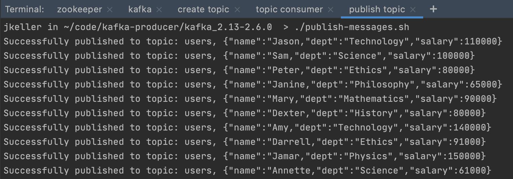
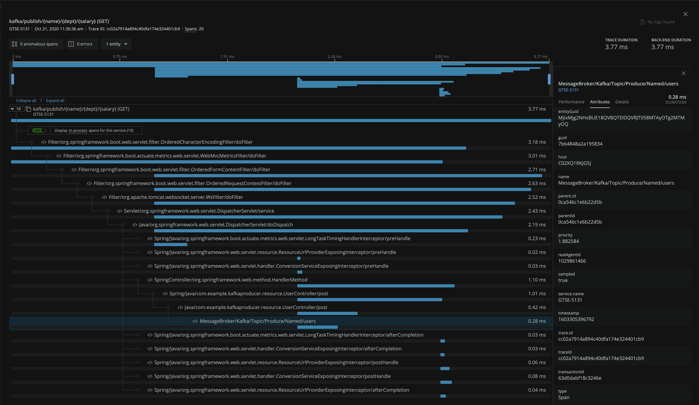

# Spring Boot Kafka Producer Example

Simple example that uses a Spring controller to publish messages to a kafka topic.

## Usage

1. In each terminal window:  
    `cd kafka_2.13-2.6.0`
2. Start zookeeper in new terminal window:  
   `./start-zookeeper.sh`
3. Start kafka server in new terminal window:  
    `./start-kafka.sh`
4. Create kafka topic in new terminal window:  
    `./create-topic.sh`
5. Start the kafka topic consumer in new terminal window:  
    `./consume-topic.sh`
6. Start the Spring app `KafkaProducerApplication`
7. Publish messages to topic in new terminal window:  
    `./publish-messages.sh`
    


## Add New Relic Java agent

Add New Relic Java agent to Intellij run config under `VM Options`:

```
-javaagent:/Users/jkeller/agents/newrelic_snapshot_build/newrelic.jar
```

Configure Java agent via the `newrelic.yml` to enable [distributed tracing for kafka](https://docs.newrelic.com/docs/agents/java-agent/instrumentation/java-agent-instrument-kafka-message-queues):

```
common: &default_settings
...
  distributed_tracing:
    enabled: true

  class_transformer:
    kafka-clients-spans:
      enabled: true
...
```

The Java agent's Spring instrumentation should automatically start a transaction based on the controller executing (`kafka/publish/{name}/{dept}/{salary} (GET)` 
in this example). 

The agent's kafka instrumentation automatically applies to the kafka producer client and since it is invoked within the transaction that the agent started for 
the Spring controller it is linked to that transaction. The result is that the span created by the kafka instrumentation is included in the distributed trace as 
`MessageBroker/Kafka/Topic/Produce/Named/users`


